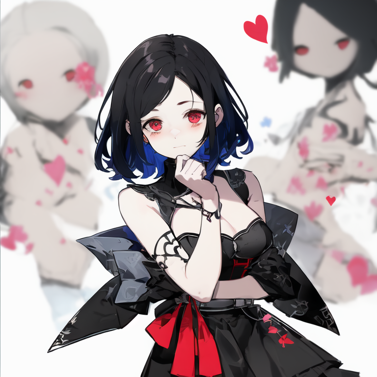
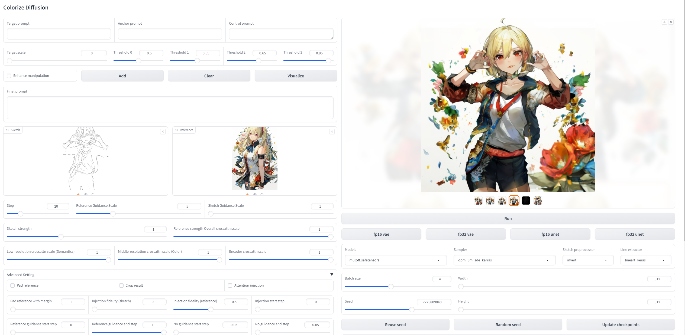
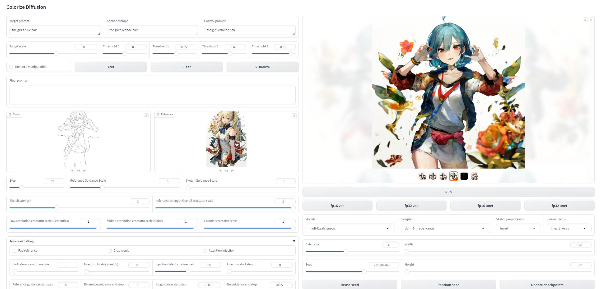

# ColorizeDiffusion: Adjustable Sketch Colorization with Reference Image and Text


(July. 2024) 
Paper link for this repository: [ColorizeDiffusion](https://arxiv.org/abs/2401.01456).  
WACV 2025 has accepted the v1 version paper (only reference-based colorization), with details about training the base denoising U-Net.
We will soon release v1.5 and v2, which solve the spatial entanglement and enhance background & style transfer.
Character-specified colorization will be enhanced this year.

We've uploaded a newer version of the technical report and soon the latest one for the released checkpoints.  
We suggest version 3 for checking the detailed explanation for the condition conflict (the distribution problem in the paper) and soon version 4 for the final architecture and training.

Model weights are available: https://huggingface.co/tellurion/colorizer.


Here in this evaluation, the inferior FID (27.4624) of T2I results was achieved by assigning mismatched (sketch, text) inputs.  
As quality-related prompts were adopted for T2I models, this FID evaluation also indicates that T2I models also slightly suffer from the distribution problem.
It's just we usually do not give text prompts conflicting with the sketches (or hard to give because there are usually margins in the background).

## Implementation Details
The repository offers the updated implementation of ColorizeDiffusion.  
Now, only the noisy model introduced in the paper, which utilizes the local tokens.

## Getting Start
To utilize the code in this repository, ensure that you have installed the required dependencies as specified in the requirements.

### To install and run:
```shell
conda env create -f environment.yaml
conda activate hf
```

## User Interface:
We also provided a Web UI based on Gradio UI. To run it, just:
```shell
python -u gradio_ui.py
```
Then you can browse the UI in http://localhost:7860/.

### Inference:
-------------------------------------------------------------------------------------------
#### Inference options:
| Options                   | Description                                                                       |
|:--------------------------|:----------------------------------------------------------------------------------|
| Crossattn scale           | Used to diminish all kinds of artifacts caused by the distribution problem.       |
| Pad reference             | Activate to use "pad reference with margin"                                       |
| Pad reference with margin | Used to diminish spatial entanglement, pad reference to T times of current width. |
| Reference guidance scale  | Classifier-free guidance scale of the reference image, suggested 5.               |
| Sketch guidance scale     | Classifier-free guidance scale of the sketch image, suggested 1.                  |
| Attention injection       | Strengthen similarity with reference.                                             |
| Visualize                 | Used for local manipulation. Visualize the regions selected by each threshold.    |

For artifacts like spatial entanglement (the distribution problem discussed in the paper) like this
  
**We've solved the spatial entanglement in the latest implementation, will be released soon.**

For current open-source version, try:
1. Activate **Pad reference** and increase **Pad reference with margin** to around 1.5, or
2. Reduce **Overall crossattn scale** to 0.4-0.8. (Best for handling all kinds of artifacts caused by the distribution problem, but accordingly degrade the similarity with referneces)

We offer a precise control of crossattn scales, check **Accurate control** part. 

A simple but effective solution to remove spatial entanglement might be directly generating amounts of semantically paired images as training data using image variation methods,   
yet this semantic alignment still results in the distribution problem.


When using stylized image like ***The Starry Night*** for style transfer, try **Attention injection** with **Karras**-based sampler.


### Manipulation:
The colorization results can be manipulated using text prompts.

For local manipulations, a visualization is provided to show the correlation between each prompt and tokens in the reference image.


The manipulation result and correlation visualization of the settings:
    
    Target prompt: the girl's blonde hair
    Anchor prompt the girl's brown hair
    Control prompt the girl's brown hair, 
    Target scale: 8
    Enhanced: false
    Thresholds: 0.5、0.55、0.65、0.95



As you can see, the manipluation unavoidably changed some unrelated regions as it is taken on the reference embeddings.

#### Manipulation options:
| Options                   | Description                                                                                                                                                                                                       |
| :-----                    |:------------------------------------------------------------------------------------------------------------------------------------------------------------------------------------------------------------------|
| Group index               | The index of selected manipulation sequences's parameter group.                                                                                                                                                   |
| Target prompt             | The prompt used to specify the desired visual attribute for the image after manipulation.                                                                                                                         |
| Anchor prompt             | The prompt to specify the anchored visaul attribute for the image before manipulation.                                                                                                                            |
| Control prompt            | Used for local manipulation (crossattn-based models). The prompt to specify the target regions.                                                                                                                   |
| Enhance                   | Specify whether this manipulation should be enhanced or not. (More likely to influence unrelated attribute).                                                                                                      |
| Target scale              | The scale used to progressively control the manipulation.                                                                                                                                                         |
| Thresholds                | Used for local manipulation (crossattn-based models). Four hyperparameters used to reduce the influnece on irrelevant visual attributes, where 0.0 < threshold 0 < threshold 1 < threshold 2 < threshold 3 < 1.0. |
| \<Threshold0 				| Select regions most related to control prompt. Indicated by deep blue.                                                                                                                                            |
| Threshold0-Threshold1     | Select regions related to control prompt. Indicated by blue.                                                                                                                                                      |
| Threshold1-Threshold2		| Select neighbouring but unrelated regions. Indicated by green.                                                                                                                                                    |
| Threshold2-Threshold3		| Select unrelated regions. Indicated by orange.                                                                                                                                                                    |
| \>Threshold3				| Select most unrelated regions. Indicated by brown.                                                                                                                                                                |
|Add| Click add to save current manipulation in the sequence.        

## Code reference
1. [Stable Diffusion v2](https://github.com/Stability-AI/stablediffusion)
2. [Stable Diffusion XL](https://github.com/Stability-AI/generative-models)
3. [SD-webui-ControlNet](https://github.com/Mikubill/sd-webui-controlnet)
4. [Stable-Diffusion-webui](https://github.com/AUTOMATIC1111/stable-diffusion-webui)
5. [K-diffusion](https://github.com/crowsonkb/k-diffusion)
6. [Deepspeed](https://github.com/microsoft/DeepSpeed)
7. [sketchKeras-PyTorch](https://github.com/higumax/sketchKeras-pytorch)
